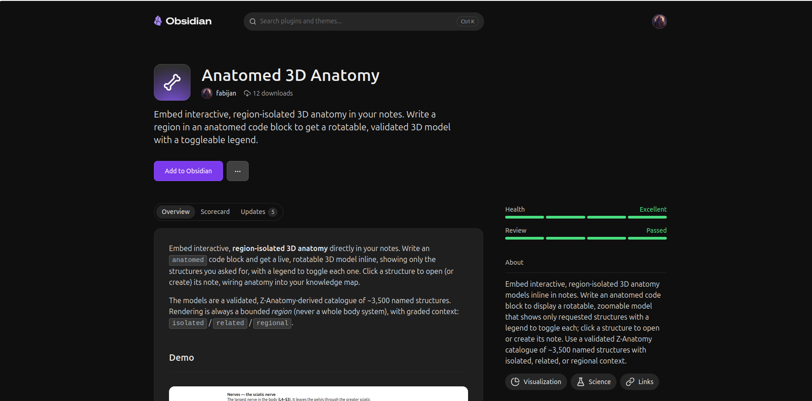

# Anatomed: 3D Anatomy for Obsidian

Embed interactive, **region-isolated 3D anatomy** directly in your notes. Write an `anatomed`
code block and get a live, rotatable 3D model inline, showing only the structures you asked
for, with a legend to toggle each one. Click a structure to open (or create) its note, wiring
anatomy into your knowledge map.

The models are a validated, Z-Anatomy-derived catalogue of ~3,500 named structures. Rendering is
always a bounded *region* (never a whole body system), with graded context: `isolated` /
`related` / `regional`.

## Demo

[](https://uafyfwyyqzunabpuftue.supabase.co/storage/v1/object/public/models/media/obsidian-demo.mp4)

Write an `anatomed` block, get a live 3D model inline, toggle structures, and click one to open
its note. Click the image to play.

## Install

Anatomed is an **official Obsidian community plugin** you can download directly from within Obsidian.

[](https://obsidian.md/plugins?id=anatomed)

**From the community catalogue:** Settings → Community plugins → **Browse** →
search **"Anatomed 3D Anatomy"** → Install → Enable.

**Manually:** download `manifest.json`, `main.js`, and `styles.css` from the
[latest release](https://github.com/pitfa19/anatomed-obsidian/releases/latest) into
`<your-vault>/.obsidian/plugins/anatomed/`, then enable the plugin in Settings → Community
plugins. Desktop only for now.

## Usage

Add a fenced `anatomed` code block to any note:

````markdown
```anatomed
region: cervical spine
detail: related
title: Cervical spine
```
````

- `region:` / `parts:` accept one or more structures (comma-separated), in English or Latin.
- `detail:` accepts `isolated` (default), `related`, or `regional` (surrounding structures shown translucent).
- `title:` sets an optional heading.

Drag to rotate, scroll to zoom, right-drag to pan; toggle structures in the legend; hover for
names. **Click a structure** to open (or create) a `[[Structure]]` note.

## Settings

- **Asset base URL**: where the 3D models (and the `related`/`regional` context data) are fetched from.
- **Structure notes folder**: where click-to-create notes are placed.
- **Viewer height** and **Default detail**.

## Privacy & network

The plugin talks to exactly **one** host: the asset base URL configured in Settings (by default
the project's public Supabase bucket). It makes only these requests, and only when you render an
`anatomed` block:

1. **GLB 3D model files** for the systems in that block.
2. **`parts-neighbors.json`** (the nearest-neighbour dataset), fetched once and only when a block
   uses `detail: related` or `detail: regional`.

There are **no other network requests**: no third-party CDNs, no analytics, and no telemetry. The
structure catalogue (`parts-catalog.json`) is bundled with the plugin and needs no network. Models
are decoded locally with a meshopt decoder (inlined in the plugin); no external decoder is fetched.

## Building from source

This repository is self-contained (see License below). The viewer core under `src/` and `widget/` is shared with
the sibling project **[anatomed-mcp](https://github.com/pitfa19/anatomed-mcp)** (which renders the
same anatomy inline in Claude).

```bash
git clone https://github.com/pitfa19/anatomed-obsidian
cd anatomed-obsidian && npm install
npm run build            # -> main.js, styles.css   (npm run dev for an unminified build)
```

Layout: `main.tsx` (plugin entry) · `src/` (region resolver + catalogue) · `widget/` (R3F viewer
+ helpers) · `assets/parts-catalog.json` (bundled catalogue). The GLB models and the
`related`/`regional` neighbour data are fetched at runtime from the asset host.

## License & attribution

The **whole plugin** — its code, the 3D anatomy models, and all data derived from
them — is licensed under **[CC BY-SA 4.0](LICENSE)** © 2026 Fabijan Pitlović. You may
use, share, and adapt it (including commercially) provided you give attribution,
indicate changes, and license derivatives under CC BY-SA 4.0 (or a compatible license).

The anatomy is derived from **[Z-Anatomy](https://www.z-anatomy.com/)** (Kervyn &
Zielinski, CC BY-SA 4.0), itself derived from **BodyParts3D** (DBCLS, CC BY-SA 2.1
Japan). See [`NOTICE`](NOTICE) for the full attribution and the changes made.
